<div align="center">
  <strong>Languages: </strong>
  <a href="README.md">中文</a> | 
  <a href="README_EN.md">English</a>
</div>

# CocoToast - PyQt5 现代化通知组件

[](LICENSE)
[](https://pypi.org/project/PyQt5/)

CocoToast 是一个基于 PyQt5 的现代化通知组件，提供多种主题和通知类型，适用于桌面应用程序中的用户反馈场景。

## 特性

- 🎨 多种主题：内置 3 种精美主题（默认、冷蓝色、冷紫色）
- 📱 响应式设计：自动适应不同分辨率
- 🔔 多种通知类型：支持成功、信息、警告、错误四种通知类型
- ⚡ 动画效果：平滑的显示/隐藏动画
- 🎯 灵活定位：支持顶部、中心、底部显示位置
- 🔄 队列管理：自动处理多个通知的显示顺序
- 🛠 高度可定制：支持自定义样式和主题

## 安装

1. 确保已安装 Python 3.6+
2. 安装依赖：
```bash
pip install PyQt5
```

## 快速开始

```python
import sys
from PyQt5.QtWidgets import QApplication, QPushButton, QVBoxLayout, QWidget
from coco_toast import ToastService

class DemoApp(QWidget):
    def __init__(self):
        super().__init__()
        self.setWindowTitle("CocoToast 演示")
        self.resize(400, 300)
        
        # 初始化 Toast 服务
        self.toast = ToastService(self, position="top", theme="default")
        
        # 创建界面
        layout = QVBoxLayout()
        
        # 添加测试按钮
        for msg_type in ["success", "info", "warning", "error"]:
            btn = QPushButton(f"显示 {msg_type} 通知")
            btn.clicked.connect(lambda _, t=msg_type: getattr(self.toast, f'show_{t}') 
                              (f"{t.upper()} 标题", f"这是一条 {t} 类型的通知消息"))
            layout.addWidget(btn)
            
        self.setLayout(layout)

if __name__ == '__main__':
    app = QApplication(sys.argv)
    window = DemoApp()
    window.show()
    sys.exit(app.exec_())
```

## 使用说明

### 基本用法

```python
# 导入 Toast 服务
from coco_toast import ToastService

# 初始化 Toast 服务
toast = ToastService(parent_widget, position="top", theme="default")

# 显示不同类型的通知
toast.show_success("操作成功", "您的数据已成功保存！")
toast.show_info("提示", "这是一条普通提示信息")
toast.show_warning("警告", "操作可能会影响系统性能")
toast.show_error("错误", "保存失败，请重试")
```

### 配置选项

| 参数名 | 类型 | 默认值 | 说明 |
|--------|------|--------|------|
| `parent` | QWidget | 必填 | 父窗口组件 |
| `position` | str | `"top"` | 通知显示位置，可选 `"top"` 、`"center"` 或`"bottom"` |
| `theme` | str | `"default"` | 主题名称，可选 `"default"`、`"cool_blue"`、`"cool_purple"` |

### 方法说明

- `show(message_type, title, message, duration=3000)` - 显示通知
  - `message_type`: 消息类型，支持 "success"、"info"、"warning"、"error"
  - `title`: 通知标题
  - `message`: 通知内容
  - `duration`: 显示时长（毫秒），0 表示不自动关闭

- `show_success(title, message, duration=3000)` - 显示成功通知
- `show_info(title, message, duration=3000)` - 显示信息通知
- `show_warning(title, message, duration=3000)` - 显示警告通知
- `show_error(title, message, duration=3000)` - 显示错误通知

## 主题预览

### 默认主题 (default)

| 类型 | 预览 |
|------|------|
| 成功 | 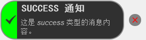 |
| 信息 | 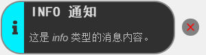 |
| 警告 | 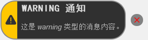 |
| 错误 | 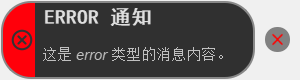 |

### 冷蓝色主题 (cool_blue)
| 类型 | 预览 |
|------|------|
| 成功 | 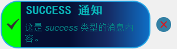 |
| 信息 | 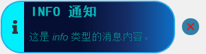 |
| 警告 | 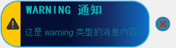 |
| 错误 | 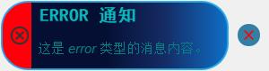 |

### 冷紫色主题 (cool_purple)
| 类型 | 预览 |
|------|------|
| 成功 | 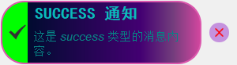 |
| 信息 |  |
| 警告 | 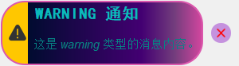 |
| 错误 | 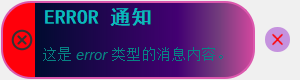 |

## 自定义消息类型

您可以通过修改 `config.json` 文件来自定义或添加新的消息类型。以下是配置说明：

### 配置文件格式

```json
{
  "消息类型名称": {
    "color": "十六进制颜色代码",
    "icon": "图标路径"
  },
  "custom_type": {
    "color": "#FFA500",
    "icon": ":icons/custom"
  }
}
```

### 自定义消息类型步骤

1. 在 `config.json` 中添加新的消息类型配置,可以使用资源文件引用(`:icons/xxx`)也可以直接指定图标路径(`icons/xxx.svg`)：

```json
{
  "info": { "color": "#00efff", "icon": ":icons/info" },
  "success": { "color": "#00ff00", "icon": ":icons/success" },
  "warning": { "color": "#ffc700", "icon": ":icons/warning" },
  "error": { "color": "#FF000A", "icon": ":icons/error" },
  "custom": { "color": "#9C27B0", "icon": ":icons/custom" }
}
```

2. 在 `icons` 目录中添加对应的图标文件（如 `custom.svg`），大小为 `30 x 30`

3. 在 `toast.qrc` 中添加图标资源（如果使用自定义图标）：

```xml
<qresource prefix="/icons">
    <!-- 其他图标 -->
    <file>icons/custom.png</file>
</qresource>
```

4. 使用自定义消息类型：

```python
# 使用自定义消息类型
toast.show("custom", "自定义通知", "这是一个自定义类型的通知消息")
```

### 动态添加消息类型

您也可以在运行时动态添加消息类型：

```python
# 动态添加自定义消息类型
from coco_toast.toast import ToastWidget

# 添加新的消息类型配置
ToastWidget.add_message_config("custom", "#9C27B0", ":icons/custom")

# 使用新添加的消息类型
toast.show("custom", "动态添加", "这是动态添加的消息类型")
```

## 自定义主题

1. 在 `themes` 目录下创建新的 CSS 文件，例如 `my_theme.css`
2. 在 `toast.py` 中的 `TOAST_THEMES` 字典添加新主题：
   ```python
   TOAST_THEMES = {
       # ... 其他主题
       "my_theme": "themes/my_theme.css"
   }
   ```
3. 使用新主题：
   ```python
   toast = ToastService(parent, theme="my_theme")
   ```

## 项目结构

```
coco_toast/
├── __init__.py
├── config.json          # 消息级别配置
├── icons/              # 图标资源
├── image/              # 预览图片
├── themes/             # 主题样式表
│   ├── default.css
│   ├── cool_blue.css
│   └── cool_purple.css
├── test.py            # 测试示例
├── toast.py           # 核心实现
├── toast.qrc          # 资源文件
├── toast.ui           # UI 设计文件
└── toast_ui.py        # 编译后的 UI 文件
```

## 贡献指南

欢迎提交 Issue 和 Pull Request。对于重大变更，请先开 Issue 讨论您想要更改的内容。

## 许可证

[MIT](LICENSE) © 2025 54Coconi


---

<div align="center">
  <p>如果这个项目对您有帮助，请考虑给个 ⭐️ 支持一下！</p>
</div>
