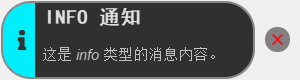
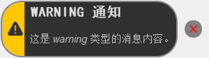
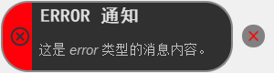
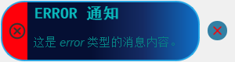
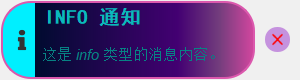
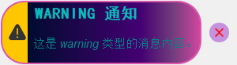
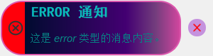

<div align="center">
  <strong>Languages: </strong>
  <a href="README.md">中文</a> | 
  <a href="README_EN.md">English</a>
</div>

# CocoToast - Modern PyQt5 Notification Component

[](LICENSE)
[](https://pypi.org/project/PyQt5/)

CocoToast is a modern notification component based on PyQt5, offering multiple themes and notification types, perfect for user feedback in desktop applications.

## Features

- 🎨 Multiple Themes: Built-in 3 beautiful themes (Default, Cool Blue, Cool Purple)
- 📱 Responsive Design: Automatically adapts to different resolutions
- 🔔 Multiple Notification Types: Support for success, info, warning, and error notifications
- ⚡ Smooth Animations: Smooth show/hide animations
- 🎯 Flexible Positioning: Supports top, center, and bottom display positions
- 🔄 Queue Management: Automatically handles multiple notification display order
- 🛠 Highly Customizable: Supports custom styles and themes

## Installation

1. Ensure Python 3.6+ is installed
2. Install dependencies:
```bash
pip install PyQt5
```

## Quick Start

```python
import sys
from PyQt5.QtWidgets import QApplication, QPushButton, QVBoxLayout, QWidget
from coco_toast import ToastService

class DemoApp(QWidget):
    def __init__(self):
        super().__init__()
        self.setWindowTitle("CocoToast Demo")
        self.resize(400, 300)
        
        # Initialize Toast service
        self.toast = ToastService(self, position="top", theme="default")
        
        # Create UI
        layout = QVBoxLayout()
        
        # Add test buttons
        for msg_type in ["success", "info", "warning", "error"]:
            btn = QPushButton(f"Show {msg_type} notification")
            btn.clicked.connect(lambda _, t=msg_type: getattr(self.toast, f'show_{t}') 
                              (f"{t.upper()} Title", f"This is a {t} type notification message"))
            layout.addWidget(btn)
            
        self.setLayout(layout)

if __name__ == '__main__':
    app = QApplication(sys.argv)
    window = DemoApp()
    window.show()
    sys.exit(app.exec_())
```

## Usage

### Basic Usage

```python
# Import Toast service
from coco_toast import ToastService

# Initialize Toast service
toast = ToastService(parent_widget, position="top", theme="default")

# Show different types of notifications
toast.show_success("Operation Successful", "Your data has been saved successfully!")
toast.show_info("Information", "This is an information message")
toast.show_warning("Warning", "This operation may affect system performance")
toast.show_error("Error", "Failed to save, please try again")
```

### Configuration Options

| Parameter | Type | Default | Description |
|-----------|------|---------|-------------|
| `parent` | QWidget | Required | Parent widget |
| `position` | str | `"top"` | Notification position, options: `"top"`, `"center"`, or `"bottom"` |
| `theme` | str | `"default"` | Theme name, options: `"default"`, `"cool_blue"`, `"cool_purple"` |

### Method Reference

- `show(message_type, title, message, duration=3000)` - Show notification
  - `message_type`: Message type, supports "success", "info", "warning", "error"
  - `title`: Notification title
  - `message`: Notification content
  - `duration`: Display duration in milliseconds, 0 means don't auto-close

- `show_success(title, message, duration=3000)` - Show success notification
- `show_info(title, message, duration=3000)` - Show info notification
- `show_warning(title, message, duration=3000)` - Show warning notification
- `show_error(title, message, duration=3000)` - Show error notification

## Theme Previews

### Default Theme
| Type | Preview |
|------|---------|
| Success |  |
| Info |  |
| Warning |  |
| Error |  |

### Cool Blue Theme
| Type | Preview |
|------|---------|
| Success |  |
| Info |  |
| Warning |  |
| Error |  |

### Cool Purple Theme
| Type | Preview |
|------|---------|
| Success |  |
| Info |  |
| Warning |  |
| Error |  |

## Custom Message Types

You can customize or add new message types by modifying the `config.json` file.

### Configuration File Format

```json
{
  "message_type_name": {
    "color": "hex_color_code",
    "icon": "icon_path"
  },
  "custom_type": {
    "color": "#FFA500",
    "icon": ":icons/custom"
  }
}
```

### Steps to Customize Message Types

1. Add a new message type configuration in `config.json`. You can use resource file references (`:icons/xxx`) or directly specify the icon path (`icons/xxx.svg`):

```json
{
  "info": { "color": "#00efff", "icon": ":icons/info" },
  "success": { "color": "#00ff00", "icon": ":icons/success" },
  "warning": { "color": "#ffc700", "icon": ":icons/warning" },
  "error": { "color": "#FF000A", "icon": ":icons/error" },
  "custom": { "color": "#9C27B0", "icon": ":icons/custom" }
}
```

2. Add the corresponding icon file (e.g., `custom.svg`) in the `icons` directory (recommended size: 30x30px)

3. Add the icon resource in `toast.qrc` (if using resource files):

```xml
<qresource prefix="/icons">
    <!-- Other icons -->
    <file>icons/custom.png</file>
</qresource>
```

4. Use the custom message type:

```python
# Use custom message type
toast.show("custom", "Custom Notification", "This is a custom notification message")
```

### Dynamic Message Type Addition

You can also add message types at runtime:

```python
# Dynamically add custom message type
from coco_toast.toast import ToastWidget

# Add new message type configuration
ToastWidget.add_message_config("custom", "#9C27B0", ":icons/custom")

# Use the newly added message type
toast.show("custom", "Dynamic Addition", "This is a dynamically added message type")
```

## Custom Themes

1. Create a new CSS file in the `themes` directory, e.g., `my_theme.css`
2. Add the new theme to the `TOAST_THEMES` dictionary in `toast.py`:
   ```python
   TOAST_THEMES = {
       # ... other themes
       "my_theme": "themes/my_theme.css"
   }
   ```
3. Use the new theme:
   ```python
   toast = ToastService(parent, theme="my_theme")
   ```

## Project Structure

```
coco_toast/
├── __init__.py
├── config.json         # Message type configuration
├── icons/             # Icon resources
├── image/             # Preview images
├── themes/            # Theme stylesheets
├── test.py           # Test examples
├── toast.py          # Core implementation
├── toast.qrc         # Resource file
├── toast.ui          # UI design file
└── toast_ui.py       # Compiled UI file
```

## License

[MIT](LICENSE) © 2025 54Coconi

---

<div align="center">
  <p>If you find this project helpful, please consider giving it a ⭐️!</p>
</div>
